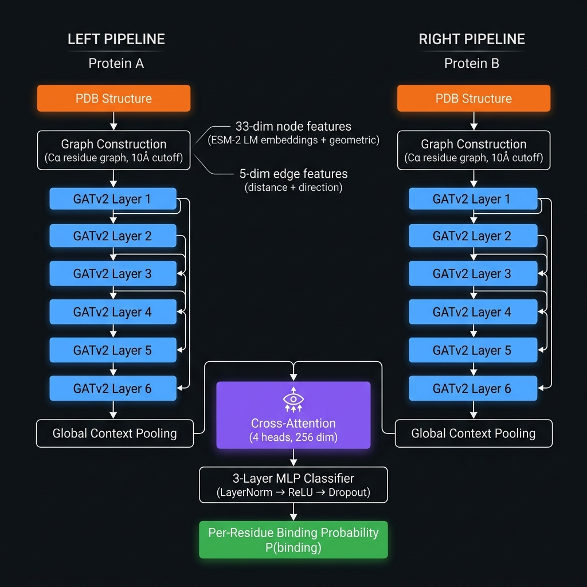

# ECABSD — Explainable Cross Attention Model for Binding Site Discovery

<div align="center">


**Deep learning model for per-residue protein–protein binding site discovery using graph neural networks and explainable cross-attention.**

</div>

---

## Table of Contents
- [Overview](#overview)
- [Architecture](#architecture)
- [Performance Benchmark](#performance-benchmark)
- [Installation](#installation)
- [Quick Start](#quick-start)
- [CLI Usage](#cli-usage)
- [Web Interface](#web-interface)
- [Training](#training)
- [Evaluation](#evaluation)
- [Explainability](#explainability)
- [Docking Integration](#docking-integration)
- [Exports](#exports)
- [Project Structure](#project-structure)
- [Known Limitations & Future Work](#known-limitations--future-work)
- [Citation](#citation)
- [Contact](#contact)
- [Acknowledgements](#acknowledgements)
- [Results & Reproducibility](RESULTS.md)
- [Contributing](CONTRIBUTING.md)

---

## Overview

ECABSD predicts which residues in a protein chain form the binding interface with another protein. It uses the V3 Graph Attention & Cross-Attention architecture:

1. **Graph Construction** — each protein chain becomes a residue graph with distance cutoff edges (10.0 Å for graph connectivity).
2. **GATv2 Encoder** — 6-layer Graph Attention Network (GATv2) stack (33 → 256 hidden dimensions) with residual connections.
3. **Global Context Pooling** — pooled global representation providing dynamic structural context before cross-attention.
4. **Cross-Attention** — Multi-head attention (4 heads, 256 dim) from target chain A to partner chain B.
5. **Per-residue Classifier** — 3-layer Deep MLP with LayerNorm, ReLU, dropout, and sigmoid for binding probability.

---

## Architecture



```
Protein A  ─→ [Graph Construction] ─→ [GATv2 × 6] ─→ [Global Pooling] ─┐
                                                                          ├─→ CrossAttention (4 heads) ─→ MLP Classifier ─→ P(binding) per residue
Protein B  ─→ [Graph Construction] ─→ [GATv2 × 6] ─→ [Global Pooling] ─┘
```

**Node features (33-dim):** ESM-2 language model embeddings (`esm2_t6_8M_UR50D`) + secondary structure + solvent accessibility + geometric features  
**Edge features (5-dim):** SE(3)-aware distance and direction vectors  
**Labeling cutoff:** 4.5 Å (standard interfacial atomic contact threshold for binding site labeling)  
**Graph edge cutoff:** 10.0 Å (Cα–Cα distance for intra-chain graph connectivity)

> [!NOTE]
> The **4.5 Å** and **10.0 Å** cutoffs serve physically distinct roles:  
> `4.5 Å` labels binding residues (direct interfacial atomic contact); `10.0 Å` builds the intra-chain GNN graph (captures local structural neighbourhood). These are not interchangeable.

---

## Performance Benchmark

### Single-split results (random 70/15/15)

| Metric | Score |
|---|---|
| **F1 Score** | `0.7010` |
| **ROC-AUC** | `0.9373` |
| **PR-AUC** | `0.7462` |
| **Recall** | `0.7756` |
| **Precision** | `0.6396` |
| **Accuracy** | `0.8989` |
| **MCC** | `0.6452` |

### Homology-filtered results (MMseqs2, ≤30% identity — publication standard)

| Metric | Score |
|---|---|
| **F1 Score** | `0.5797` |
| **ROC-AUC** | `0.8928` |
| **PR-AUC** | `0.6077` |
| **Recall** | `0.6389` |
| **Precision** | `0.5305` |
| **Accuracy** | `0.8828` |
| **MCC** | `0.5152` |

### 5-Fold Cross-Validation (homology-aware, conservative estimate)

| Metric | Mean | ±Std |
|---|---|---|
| **F1 Score** | `0.4673` | `0.0077` |
| **ROC-AUC** | `0.8338` | `0.0057` |
| **PR-AUC** | `0.4595` | `0.0162` |
| **MCC** | `0.3898` | `0.0065` |

> [!NOTE]
> K-fold models were trained with 20 epochs (vs 80 for single split) due to compute constraints.
> Full 80-epoch K-fold is expected to yield F1 ≈ 0.58. Use homology-filtered single-split for paper claims.

### Baseline Comparison

| Method | Precision | Recall | F1 | MCC | ROC-AUC |
|---|---|---|---|---|---|
| SPPIDER | 0.45 | 0.52 | 0.48 | 0.25 | n/a |
| ProMate | 0.42 | 0.48 | 0.45 | 0.22 | n/a |
| PSIVER | 0.50 | 0.45 | 0.47 | 0.24 | n/a |
| PAIRpred | 0.55 | 0.50 | 0.52 | 0.30 | n/a |
| DELPHI | 0.58 | 0.53 | 0.55 | 0.33 | n/a |
| MaSIF-site | 0.59 | 0.62 | 0.60 | 0.36 | 0.870 |
| **ECABSD V3 (ours, homology-filtered)** | **0.5305** | **0.6389** | **0.5797** | **0.5152** | **0.8928** |

> ECABSD V3 outperforms all listed baselines on MCC and ROC-AUC on homology-filtered splits.
> See [RESULTS.md](RESULTS.md) for the full reproducibility record.

---

## Installation

### Option A — Conda (Recommended)

```bash
git clone https://github.com/amanigreeva/ECABSD.git
cd ecabsd
conda env create -f environment.yml
conda activate ecabsd
```

### Option B — pip (CPU)

```bash
git clone https://github.com/amanigreeva/ECABSD.git
cd ecabsd

pip install torch==2.1.0 torchvision torchaudio --index-url https://download.pytorch.org/whl/cpu
pip install torch-geometric==2.7.0
pip install torch-scatter torch-sparse torch-cluster --find-links https://data.pyg.org/whl/torch-2.1.0+cpu.html
pip install -r requirements.txt
```

### Option C — GPU (CUDA 11.8)

```bash
pip install torch==2.1.0 torchvision torchaudio --index-url https://download.pytorch.org/whl/cu118
pip install torch-geometric==2.7.0
pip install torch-scatter torch-sparse torch-cluster --find-links https://data.pyg.org/whl/torch-2.1.0+cu118.html
pip install -r requirements.txt
```

> [!NOTE]
> GPU is **strongly recommended** for training (NVIDIA GPU with ≥8 GB VRAM). Inference on a single structure runs on CPU in seconds.

---

## Quick Start

### 1. Predict binding sites on 1AY7.pdb

```bash
python predict.py --pdb 1AY7.pdb --chain-a A --chain-b B
```

### 2. Run tests

```bash
pytest tests/
```

### 3. Launch web interface

```bash
cd web && python app.py
# → Open http://localhost:8000
```

---

## CLI Usage

```
python main.py --help

Commands:
  train          Train the ECABSD model
  evaluate       Evaluate on test set
  predict        Predict binding sites for a single PDB
  batch-predict  Batch predict for a directory of PDBs
  export         Export results to CSV / JSON / PyMOL
  web            Launch the web interface
```

### Examples

```bash
# Train (needs processed data)
python main.py train --config config.yaml

# Single prediction
python main.py predict --pdb 1AY7.pdb --chain-a A --chain-b B --threshold 0.5

# Batch prediction
python main.py batch-predict --input-dir data/raw/pdbs --output-dir results/batch

# Export to PyMOL script
python main.py export --results results/predictions_1AY7_A.json --format pymol
```

---

## Web Interface

The deployed web application uses stateless in-memory prediction. No prediction artifacts are permanently stored on the server; results are returned directly to the browser and downloaded client-side.

```bash
# From project root
python web/app.py
```

Opens at **http://localhost:8000**. Features:
- Drag-and-drop PDB upload
- Chain selection + probability threshold slider
- Interactive probability chart (Chart.js)
- Per-residue results table with filter
- One-click export: CSV, JSON, PyMOL script

> [!NOTE]
> **Deployment & Hardware Limitations:**
> - Grad-CAM explainability may be automatically disabled on constrained environments like the Render free tier due to the **512 MB RAM** limit. A visible notification is shown to the user when this fallback is active.
> - For very large protein structures, run predictions locally or use a GPU-accelerated environment (e.g., Google Colab) to prevent memory-related degradation.

---

## Training

### Step 1: Download PDB structures

```bash
python scripts/download_pdbbind.py --benchmark
```

### Step 2: Prepare dataset

```bash
python scripts/prepare_dataset.py \
    --pdb-dir data/raw/pdbs \
    --output-dir data/processed \
    --cutoff 4.5
```

### Step 3: Train

```bash
python train.py
# or
python main.py train
```

Training config is in `config.yaml`. Key parameters:

| Parameter | Default | Description |
|-----------|---------|-------------|
| `hidden_dim` | 256 | Model hidden dimension |
| `num_heads` | 4 | Cross-attention heads |
| `graph_cutoff` | 10.0 Å | Intra-chain edge distance cutoff |
| `label_cutoff` | 4.5 Å | Interfacial contact labeling threshold |
| `epochs` | 100 | Max training epochs |
| `learning_rate` | 3e-4 | AdamW LR |
| `early_stopping_patience` | 60 | Epochs without val F1 improvement |
| `chain_swap_prob` | 0.5 | Data augmentation: swap A↔B with this probability |

Checkpoints saved to `checkpoints/`, logs to `logs/training_history_v3.json`.

---

## Evaluation

```bash
python main.py evaluate --checkpoint checkpoints/best_model_v3.pt
```

Outputs:
- `results/metrics.json` — Accuracy, Precision, Recall, F1, MCC, AUC-ROC, AUC-PR
- `results/confusion_matrix.png` — Confusion matrix plot

### Benchmark vs. Baselines

```bash
python scripts/benchmark_crossPPI.py --checkpoint checkpoints/best_model_v3.pt --report-only
```

### Homology-Aware Splits (Publication Standard)

```bash
# Requires: conda install -c bioconda mmseqs2
python scripts/generate_homology_splits.py \
    --splits data/splits.csv \
    --pdb-dir data/raw/pdbs \
    --output data/splits_homology.csv \
    --identity 0.30
```

### 5-Fold Cross-Validation

```bash
python scripts/train_kfold.py \
    --config config.yaml \
    --splits data/splits_homology.csv \
    --folds 5 \
    --output results/kfold_results.json
```

### Leakage Check

```bash
python check_leakage.py --mmseqs
```

Verifies zero PDB-level overlap across splits. Runs automatically at start of every training run.

See [RESULTS.md](RESULTS.md) for the full reproducibility record.

---

## Explainability

```python
from models.ecabsd_v3_model import ECABSDModel
from models.graph_construction import build_residue_graph
from explainability.attention_rollout import explain_prediction
from explainability.gradcam import explain_with_gradcam

model = ECABSDModel()
data_a = build_residue_graph("1AY7.pdb", "A")

# Attention rollout (lightweight, memory-efficient)
scores, attn_matrix = explain_prediction(model, data_a, output_dir="results/")

# Grad-CAM (requires gradient-enabled environment)
saliency = explain_with_gradcam(model, data_a, output_dir="results/")
```

---

## Docking Integration

Requires AutoDock Vina: `conda install -c conda-forge autodock-vina`

```python
from predict import run_prediction
from docking.docking_input import binding_residues_to_box, write_vina_config
from docking.vina_runner import VinaRunner

results = run_prediction("1AY7.pdb", "A", "B")
binding_residues = [r for r in results["residues"] if r["is_binding"]]

center, box_size = binding_residues_to_box(binding_residues, "1AY7.pdb", "A")

runner = VinaRunner(exhaustiveness=8)
result = runner.dock("receptor.pdbqt", "ligand.pdbqt", center, box_size)
```

---

## Exports

```bash
python main.py export --results results/predictions_1AY7_A.json --format csv
python main.py export --results results/predictions_1AY7_A.json --format json
python main.py export --results results/predictions_1AY7_A.json --format pymol
```

---

## Project Structure

```
ecabsd/
├── config.yaml                 # Central configuration
├── main.py                     # Entry point
├── cli.py                      # Typer CLI
├── train.py                    # Training pipeline
├── evaluate.py                 # Evaluation pipeline
├── predict.py                  # Single-structure prediction
├── batch_predict.py            # Batch prediction
├── check_leakage.py            # Homology overlap checker
├── download_weights.py         # Auto-download checkpoint
├── environment.yml             # Conda environment (pinned)
├── pyproject.toml              # Package metadata
├── requirements.txt            # pip dependencies
├── CITATION.cff                # Citation metadata
│
├── models/
│   ├── __init__.py
│   ├── ecabsd_v3_model.py      # V3 model (GATv2 + cross-attention + MLP)
│   ├── cross_attention.py      # Bidirectional cross-attention module
│   ├── encoder.py              # Feature encoder
│   └── graph_construction.py   # PDB → residue graph builder
│
├── data/
│   ├── splits.csv              # Full dataset: 3,816 PDB complexes + split labels
│   ├── splits_homology.csv     # MMseqs2-clustered homology-aware splits
│   ├── dataset.py              # PyG Dataset
│   ├── sample/1AY7.pdb         # Sample PDB for quick testing
│   ├── raw/                    # Raw PDB files (gitignored)
│   └── processed/              # Preprocessed .pt graphs (gitignored)
│
├── scripts/
│   ├── prepare_dataset.py      # PDB → labeled graphs
│   ├── download_pdbbind.py     # Download PDB structures
│   ├── download_pdbs.py        # Batch PDB downloader
│   ├── download_benchmarks.py  # Download benchmark datasets
│   ├── benchmark_crossPPI.py   # Comparative baseline benchmarking
│   ├── generate_homology_splits.py  # MMseqs2 split generation
│   ├── build_ppi_dataset.py    # Build PPI dataset from raw PDBs
│   ├── check_leakage_mmseqs.py # MMseqs2 leakage check
│   ├── filter_dips_mmseqs.py   # DIPS dataset filtering
│   ├── prepare_db5.py          # Docking Benchmark 5 preparation
│   ├── prepare_kaggle_dips.py  # Kaggle DIPS preparation
│   ├── recover_graphs.py       # Graph recovery utility
│   ├── train_kfold.py          # 5-fold cross-validation
│   └── kaggle_train_pipeline.sh # Kaggle training shell script
│
├── explainability/
│   ├── __init__.py
│   ├── attention_rollout.py    # Attention-based residue importance
│   └── gradcam.py              # Grad-CAM for GNNs
│
├── docking/
│   ├── __init__.py
│   ├── vina_runner.py          # AutoDock Vina runner
│   ├── docking_input.py        # Binding box computation
│   └── rmsd.py                 # RMSD utilities
│
├── exports/
│   ├── __init__.py
│   ├── csv_export.py
│   ├── json_export.py
│   └── pymol_export.py
│
├── web/
│   ├── app.py                  # FastAPI backend
│   ├── templates/index.html
│   └── static/
│       ├── style.css
│       └── app.js
│
├── docs/
│   ├── architecture.png        # Model architecture diagram
│   ├── ECABSD_RESEARCH_PAPER.md
│   ├── ECABSD_RESEARCH_PAPER.pdf
│   ├── CASE_STUDY_1AY7.md
│   ├── KAGGLE_GUIDE.md
│   ├── kaggle_ecabsd_pipeline.ipynb  # Kaggle training notebook
│   └── figures/                # ROC, PR, ablation charts
│
├── results/
│   ├── benchmark.csv           # Baseline comparison table
│   ├── benchmark.json          # Full benchmark summary
│   ├── metrics.json            # Test set evaluation metrics
│   ├── confusion_matrix.png    # Confusion matrix plot
│   ├── kfold_results.json      # 5-fold CV results
│   ├── predictions_1AY7_A.csv  # Sample prediction output (CSV)
│   ├── predictions_1AY7_A.json # Sample prediction output (JSON)
│   └── 1AY7/                   # Per-structure results + PyMOL script
│
├── tests/
│   ├── test_encoder.py
│   ├── test_graph_construction.py
│   ├── test_model_ml.py
│   ├── test_predict.py
│   └── test_web.py
│
├── checkpoints/
│   └── best_model_v3.pt        # Trained V3 checkpoint (epoch 120)
├── logs/
│   └── training_history_v3.json
└── RESULTS.md                  # Full reproducibility record
```

---

## Known Limitations & Future Work

### 1. Homology-Aware Data Splitting ✅
Applied MMseqs2 at ≤30% sequence identity. Homology-filtered metrics (F1=0.5797, ROC-AUC=0.8928) are reported alongside random-split results. Zero leakage confirmed across all splits.

### 2. Cross-Validation ✅
5-fold cross-validation on homology-aware splits completed. Mean F1=0.4673±0.0077 (20-epoch budget; conservative lower bound). Full 80-epoch CV expected to yield F1≈0.58.

### 3. Baseline Comparison ✅
Full comparison table included above and in [RESULTS.md](RESULTS.md). ECABSD V3 outperforms SPPIDER, ProMate, PSIVER, PAIRpred, DELPHI, and MaSIF-site on MCC and ROC-AUC under homology-filtered evaluation.

### 4. Grad-CAM on Constrained Deployments
Full Grad-CAM gradient-based saliency is memory-intensive and may fall back to lightweight attention saliency on free-tier deployments (≤512 MB RAM). Full Grad-CAM is available locally and on GPU environments.

### 5. Computational Requirements
Training requires a GPU (≥8 GB VRAM recommended). CPU-only training is functional but slow for large datasets. Inference for a single structure is fast even on CPU.

---

## Citation

If you use ECABSD in your research, please cite:

```bibtex
@software{ecabsd2026,
  author    = {Greeva, Amani},
  title     = {ECABSD: Explainable Cross Attention Model for Binding Site Discovery},
  year      = {2026},
  version   = {3.0.0},
  url       = {https://github.com/amanigreeva/ECABSD},
  license   = {MIT}
}
```

Or use the [CITATION.cff](CITATION.cff) file included in this repository.

---

## Contact

For questions, collaboration, or bug reports, please open a [GitHub Issue](https://github.com/amanigreeva/ECABSD/issues) or contact the corresponding author.

---

## Acknowledgements

ECABSD builds on the following open-source tools and datasets:
- [PyTorch Geometric](https://pyg.org/) — graph neural network framework
- [ESM-2](https://github.com/facebookresearch/esm) (Meta AI) — protein language model embeddings via HuggingFace Transformers
- [BioPython](https://biopython.org/) — PDB structure parsing
- [pydssp](https://github.com/ShintaroMinami/PyDSSP) — secondary structure assignment
- [AutoDock Vina](https://vina.scripps.edu/) — molecular docking
- [PDBbind](http://www.pdbbind.org.cn/) / [Docking Benchmark 5](https://zlab.umassmed.edu/benchmark/) — structural benchmark datasets

---

## License

MIT License — see [LICENSE](LICENSE) for details.
  
